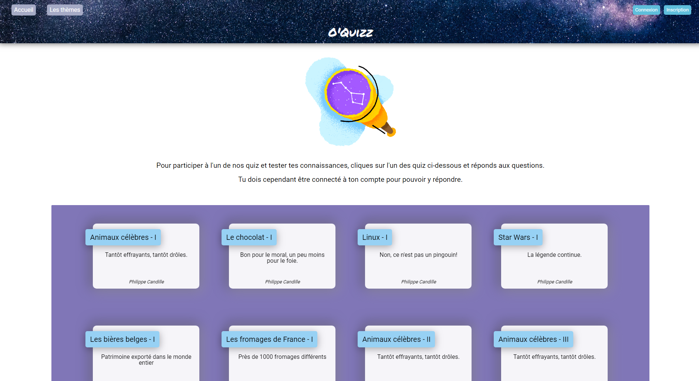
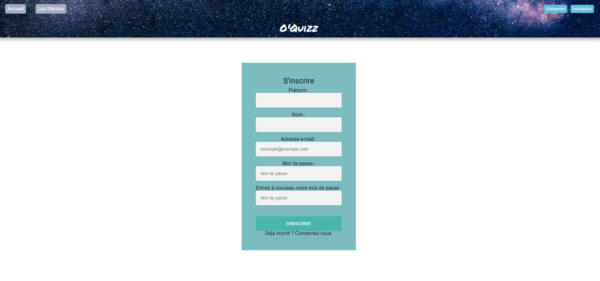
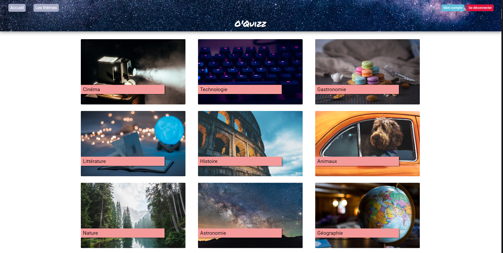
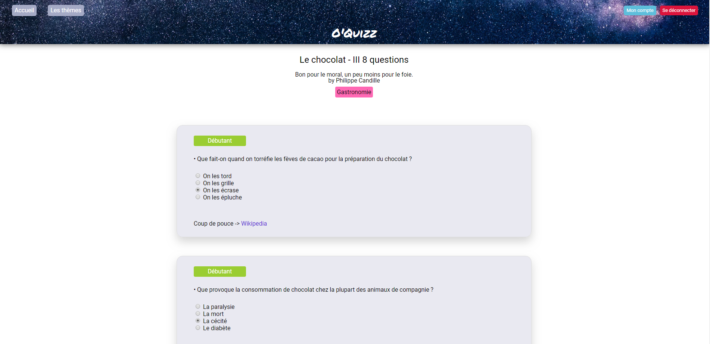
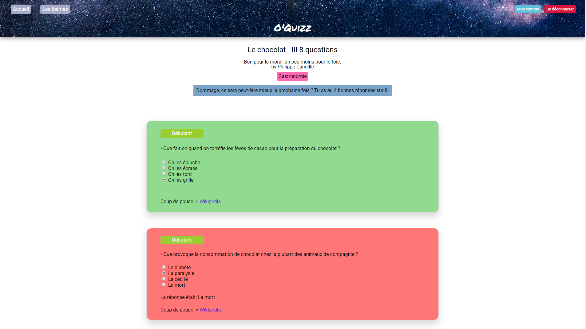

# Lumen, un micro-framework par Laravel

Après avoir commencé à abordé Lumen durant la formation à O'Clock, nous avons du de manière autonome réaliser une application avec ce dernier. 
Afin d'avoir une base commune, quelques fichiers étaient déjà fournis:
- MCD
- MLD
- import SQL
- user stories

Cependant, nous étions libre concernant les choix techniques, le CSS, la seule contrainte était d'utiliser Lumen. Nous avions plusieurs journées dédiées pour réaliser ce projet "Oquiz".

L'application a donc été réalisée sans framework CSS, j'ai tout réalisé de moi-même pour m'entrainer un peu plus sur ce domaine. J'ai également ajouté la librairie Toastr.js pour rajouter un toast lors de la deconnexion.
Sur la page d'accueil, on peut retrouver toutes les questions cliquables, ainsi qu'une navbar pour se connecter ou s'inscrire, et la liste des thèmes des questions. 

Pour jouer à un quiz c'est très simple. 
On clique sur le quiz souhaité, ce qui nous ramène vers une ligne de questions. Chaque question possède un "niveau" (Débutant, confirmé et expert) et une seule réponse est possible. A chaque nouvelle partie, les réponses changent d'ordre.

En bas de ces questions, vous pouvez cliquer sur le bouton "Verifier" pour connaître son score et les bonnes ou mauvaises réponses. Si l'on a plus de 4 bonnes réponses, alors le message est différent et devient "Bravo" suivi du score. 

Pour en voir plus, n'hésitez pas à cloner le projet et à ouvrir le dossier public en local une fois le fichier sql importé ! 

